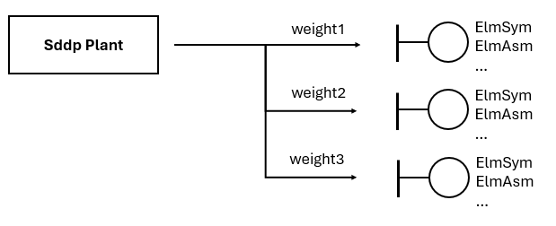

# Plant dispatch

This script distribute Sddp plant's generation in PowerFactory generators.


## Usage

1. Run Sddp with appropriate result files enabled
    - Thermal generation
    - Renewable generation
    - Hydro generation
    - Battery generation
    - CSP generation
    - Power injection output
2. [Create a CSV file mapping Sddp scenarios to PowerFactory scenarios](#scenario-names)
3. [Create a CSV file mapping Sddp plants to PowerFactory generator elements](#sddp-plantpowerfactory-elm-mapping)
4. Run [](sddp_plant_dispatch.py) script:

```bat
python sddp_plant_dispatch.py -p "Project Name" --path "C:\temp\sddp_case"
```


### Input files

The following input files are required to run the script:

| Input File                                               | Description                                         |
|:---------------------------------------------------------|:----------------------------------------------------|
| [scenario_names.csv](#scenario-names)                    | Maps Sddp scenarios to PowerFactory scenario names  |
| [plant_elm_map.csv](#sddp-plantpowerfactory-elm-mapping) | Maps Sddp plants to PowerFactory generator elements |


#### Scenario names

Maps a Sddp scenario to a PowerFactory scenario name.

|     Column      | Description                 |
|:---------------:|:----------------------------|
|  Stage Number   | Sddp stage number           |
| Scenario Number | Sddp scenario number        |
|  Block Number   | Sddp block or hour number   |
|  Scenario Name  | PowerFactory scenario name  |


#### Sddp Plant/PowerFactory Elm* mapping

It's possible to distribute Sddp Plants' generation in multiple PowerFactory generators using weights. The figure below illustrates it.




The file name is `plant_elm_map.csv` and its column names are:

|   Column   | Description                                                          |
|:----------:|:---------------------------------------------------------------------|
| System ID  | String with Sddp system id                                           |
| Plant Type | String with Sddp plant type                                          |
| Plant Name | String with Sddp plant name                                          |
|   Weight   | Distribution weight of plant power to powerfactory generator element |
|  Element   | PowerFactory generator element name in `name.class` format           |


Supported plant types:

| Plant Type | Description                    |
|:----------:|:-------------------------------|
|   hidro    | Hydro plant                    |
|  thermal   | Thermal plant                  |
| renewable  | Renewable plant                |
|  battery   | Battery                        |
|    csp     | Concentrated solar power plant |
| injection  | Injection                      |


Supported PowerFactory generator classes:

|   Class    | Modified Attribute |
|:----------:|:-------------------|
|   ElmSym   | `pgini`            |
|   ElmAsm   | `pgini`            |
| ElmGenstat | `pgini`            |
|  ElmAsmsc  | `pgini`            |
|  ElmPvsys  | `pgini`            |
|  ElmXnet   | `pgini`            |
